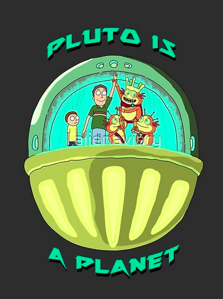

Enum Types: Arnold se está cociendo
===================================

Esta semana vamos a introducir un nuevo concepto de programación, los **tipos enumerados**. Son muy sencillos y no necesitan mucha explicación. Eso sí, son un ejemplo fantástico del **patrón singleton**, y resuelven muchos problemas en la vida real TM.

Recomiendo leer el **capítulo 18 "Enum Types" del Libro _Beginning Java 8 Fundamentals_**. Se explican a través de un par de ejercicios que recomiendo ir codificando en vuestro editor favorito `IntelIJ throws FileNotSupportedException`

Además, vamos a prácticar TDD:

- He incluido los casos test que ha de pasar vuestro código.
- He incluido el programa principal.
  
De esta manera, nos aseguramos que aprendéis todo lo que es necesario saber sobre tipos enumerados, y aprendéis las **_fluent assertions_**, que harán vuestros casos test más optimos.

## Ejercicio

Se trata de calcular el peso de una persona en los distintos planetas de nuestro Sistema Solar[^1], al estilo de este sitio web:

http://www.traducimos.cl/planet/

Es importante evitar que os suceda lo de Arnold en Desafio Total[^2] cuando salió a dar un paseíto por la superficie marciana, estando de cuarentena como estábamos en marzo de 2019:

[](https://www.youtube.com/watch?v=86scPKqWFvc)


El peso en otro planeta se lo preguntáis a vuestros compañeros que han estudiado Física en la universidad o bachiller (call @Arturo [@JoanNicolau](https://github.com/nicolaujoan) y cia). Si no se lo saben de memoria, aplicad este sencilla fórmula:

$$ Peso \ en \ Superficie = tu \ Masa \times Gravedad \ en \ superficie $$

donde:

$$ Gravedad \ en \ superficie = G \times \frac {Masa \ del \ planeta} {Radio \ del \ planeta \ al \ cuadrado} $$

donde: 

$$ G = 6.67300E-11 $$

y 

$$ tu \ masa = \frac{tu \ peso \ en \ la \ Tierra} {gravedad \ superficial \ Tierra} $$

Los valores de masa y radio de cada planeta (en $Kg$ y $m$ respectivamente) son:

```java
MERCURY (3.303e+23, 2.4397e6),     
VENUS   (4.869e+24, 6.0518e6),     
EARTH   (5.976e+24, 6.37814e6),     
MARS    (6.421e+23, 3.3972e6),     
JUPITER (1.9e+27,   7.1492e7),     
SATURN  (5.688e+26, 6.0268e7),     
URANUS  (8.686e+25, 2.5559e7),     
NEPTUNE (1.024e+26, 2.4746e7);      
```

Si completas la función `main` para recoger argumentos desde línea de comandos, la salida del programa en consola podría ser esta, donde `175` es tu peso en la Tierra:

$$ tu \ masa = \frac{tu \ peso \ en \ la \ Tierra}{gravedad \ superficial \ tierra} $$

```sh
$ java Planet 175 
Your weight on MERCURY is 66.107583 
Your weight on VENUS is 158.374842 
Your weight on EARTH is 175.000000 
Your weight on MARS is 66.279007 
Your weight on JUPITER is 442.847567 
Your weight on SATURN is 186.552719 
Your weight on URANUS is 158.397260 
Your weight on NEPTUNE is 199.207413
```

## Casos test - AssertJ Fluent Assertions

Estos son los casos test que ha de satisfacer tu código: [/src/test/java/org/foobarspam/arnoldEnumType/test/ArnoldEnumTypeTest.java](./src/test/java/org/foobarspam/arnoldEnumType/test/ArnoldEnumTypeTest.java "casos test")

Utilízalos para practicar TDD y que te guién en el diseño del código. 

Para utilizar estos casos test, has de incluir en el `POM.xml` del proyecto Maven o en el fichero `build.gradle` una dependencia adecuada a la librería de **AssertJ**. Búscala en el [repo de Maven](https://mvnrepository.com/ "maven repository"):

```xml
	<dependency>
    	<groupId>org.assertj</groupId>
    	<artifactId>assertj-core</artifactId>
    	<version>[3.22.0,)</version>
    	<scope>test</scope>
	</dependency>
```

¿Cómo funcionan las Fluent Assertions?: 

[AssertJ - fluent assertions java library](https://assertj.github.io/doc/)


## Script principal - main

Programa la lógica para que, además de los casos test, satisfaga el script principal del programa: [ArnoldMain.java](./src/main/java/org/foobarspam/arnoldEnumType/main/ArnoldMain.java "main App")


### Solución

Resuelto por mi: [Planeta.java](./src/main/java/org/foobarspam/arnoldEnumType/logica/Planeta.java "Planeta.java")

Resuelto por Oracle: [Enum Types, the Java Tutorials](https://docs.oracle.com/javase/tutorial/java/javaOO/enum.html "Enum type Java Tutorials")


------
[^1]: ¿Y Plutón? ¿Dónde está Plutón?  

[](https://www.youtube.com/watch?v=aIVOIaYxaTo "video Rick & Morty Pluno is not a planet")

------
[^2]: Existe una versión mucho más divertida, ingeniosa y edificante de la infame película Desafío Total en el capítulo 4 de la temporada 2 de Rick and Morty, titulado "Total Rickall". Eso sí, tiros y vísceras hay a partes iguales.
